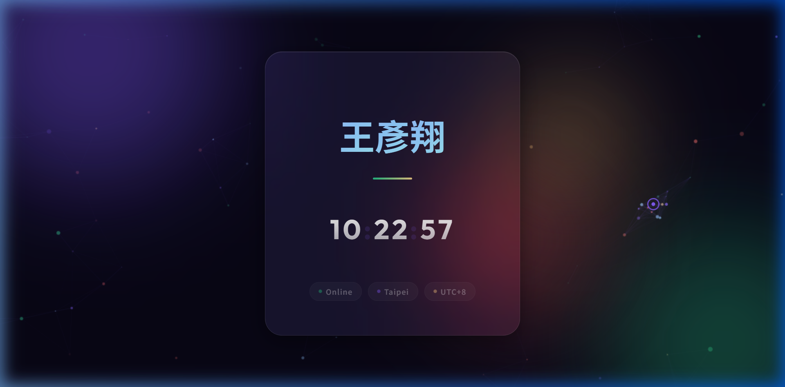

# Project Summary - March 3, 2026

## Overview
Today, we developed and deployed a modern, dynamic personal webpage for **王彥翔 (Wang Yan-Xiang)**. The project involved creating a highly interactive frontend with particle effects, 3D animations, and real-time features, then deploying it via GitHub Pages.

**Live Demo:** [https://sssh27.github.io/AIoT-personal-page/](https://sssh27.github.io/AIoT-personal-page/)

## Completed Tasks

### 1. Web Development
- **Main Interface (`index.html`)**: Built a sleek, single-page layout featuring a dynamic greeting, real-time clock display, and interactive status badges (Online, Taipei, UTC+8).
- **Glassmorphism Design**: Implemented a frosted-glass card design with backdrop blur, smooth gradients, and a premium dark theme.
- **Interactive Particle System**: Created a canvas-based particle network with 100+ floating particles that respond to mouse movement and form dynamic connections.
- **3D Card Tilt Effect**: Added perspective-based 3D tilting that follows the cursor position over the card.
- **Custom Cursor**: Implemented a custom animated cursor with a trailing dot and hover state changes.
- **Mouse Trail**: Added a glowing purple trail that follows mouse movement across the page.
- **Flip Clock Animation**: Digits animate with a flip effect when the time changes, with blinking separators.
- **Character-by-Character Animation**: Each character of the name "王彥翔" animates individually on page load and responds to hover.
- **Click Ripple Effects**: Clicking anywhere on the page creates an expanding purple ripple animation.
- **Parallax Orbs**: Background gradient orbs shift with mouse movement for added depth.

### 2. Git & GitHub Integration
- **Local Initialization**: Initialized a new Git repository in the project directory.
- **Token Authentication**: Used a GitHub Personal Access Token (PAT) for secure authentication.
- **Repository Creation**: Created the remote repository [AIoT-personal-page](https://github.com/sssh27/AIoT-personal-page) on GitHub.
- **Successful Deployment**: Pushed the codebase and enabled GitHub Pages on the `main` branch.
- **Repository Metadata**: Updated the About section with project description and live demo link.

## File Structure
- `index.html`: Core structure, styling, and interactive JavaScript — all in a single file.
- `README.md`: This project documentation.

## Technologies Used
- HTML5 / CSS3 / Vanilla JavaScript
- Canvas API (Particle system & mouse trail)
- CSS Animations & Transitions
- Google Fonts (Noto Sans TC, Outfit)
- GitHub Pages (Hosting)

## Future Recommendations
- Add more personal sections (About, Skills, Projects, Contact).
- Integrate social media links (GitHub, LinkedIn, etc.).
- Add a dark/light theme toggle.
- Make the particle system touch-friendly for mobile devices.
